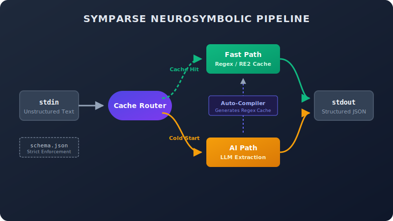

<div align="center">
  

  <h1><code>symparse</code></h1>
  
  <p><strong>The AI <code>jq</code> for unstructured text. From 100% LLM latency to 95% regex speeds in one run.</strong></p>

  <p>
    <a href="https://github.com/Aftermath-Technologies-Ltd/symparse/actions"></a>
    <a href="https://pypi.org/project/symparse/"></a>
    <a href="https://hub.docker.com/r/aftermath/symparse"></a>
    <a href="https://github.com/Aftermath-Technologies-Ltd/symparse/blob/main/LICENSE"></a>
    
  </p>
</div>

*Note on Stability: Symparse utilizes `litellm` to expose multi-model routing to Ollama, OpenAI, vLLM, and Anthropic seamlessly via the `--model` flag. All massive dependencies, especially `torch` and `google-re2`, are strictly pinned to exact versions natively preventing ecosystem drift.*

---

**Symparse** is a self-optimizing Unix pipeline tool that routes data between an **AI Path** (using local LLMs via `litellm`) and a **Fast Path** (using cached, sandboxed `re2`-based Python extraction scripts) with a strict neurosymbolic JSON validation gate.

You get the magical, unstructured data extraction of Large Language Models, with the raw performance and ReDoS-safety of compiled C++ regular expressions on 95% of subsequent matched traffic.

## 🚀 Installation

Install Symparse from PyPI:

```bash
pip install symparse
```

Or with optional but recommended Tier-2 Local Vector Embeddings (uses `sentence-transformers` for vastly superior cache hit-rates against polymorphic logs):

```bash
pip install symparse[embed]
```
> [!WARNING]
> The `[embed]` extra installs PyTorch. Depending on your environment, pip may resolve a massive 2.5GB CUDA payload. If you are installing this on a minimal log server, you can strictly install the CPU-only torch wheel first, then run `pip install symparse[embed]` to keep the footprint lightweight.

Or from source:

```bash
git clone https://github.com/Aftermath-Technologies-Ltd/symparse.git
cd symparse
pip install -e .
```

## ⚡ Usage

Symparse is built for Unix pipes. You stream standard text into `stdin` and provide a JSON Schema describing your desired format. Symparse enforces that structure and outputs valid JSON objects to `stdout`.

### Basic Example

Parse a messy raw text log into a clean standard JSON string:

```bash
# We have a messy text input:
echo "User alice@example.com logged in from 192.168.1.50 at 10:45 AM" | \
symparse run --schema login_schema.json --compile
```

** `login_schema.json` **:
```json
{
  "type": "object",
  "properties": {
    "email": { "type": "string" },
    "ip_address": { "type": "string" }
  },
  "required": ["email", "ip_address"]
}
```

** Output (`stdout`) **:
```json
{
  "email": "alice@example.com",
  "ip_address": "192.168.1.50"
}
```

Because we passed `--compile`, Symparse will use the LLM (AI Path) on this first pass to deduce a standard Re2 regex schema. The next time a log matching this prototype is fired, Symparse will hit the **Fast Path Cache**, completely bypassing the LLM. 

### Live Verified Fallback (Graceful Degradation)

Symparse is built to natively handle imperfect LLM generation on the fly. In a live test using the lightweight local `gemma3:1b` model to parse messy logs, here is how the neurosymbolic loop behaved:

1. **Log 1 (`Cold Start`)**: User logs in. LLM extracts correctly and creates a Fast Path Regex Cache.
2. **Log 2 (`Fast Path`)**: User logs out. Symparse attempts to use the Regex cache.
3. **Execution**: The Regex cache was slightly imprecise (a flaw in the 1B parameter model's generation), missing a field requirement.
4. **Graceful Self-Healing**: Symparse detected the strict `SchemaViolationError` mid-stream, safely purged the flawed Regex from its cache, seamlessly fell back to the local `gemma3:1b` AI Path, precisely extracted the exact JSON needed, and returned it to `stdout`—all without crashing the active Unix pipeline.

### Streaming Logs (`tail -f`)

Symparse excels at processing live unstructured data feeds. 
For example, attaching it directly to an Apache or Nginx log tail stream:

```bash
tail -f /var/log/nginx/access.log | symparse run --schema access_schema.json --compile >> parsed_logs.jsonl
```

### CLI Options

**Global flags** (before any subcommand):
```text
usage: symparse [-h] [-v] [--version] {run,cache} ...

Symparse: LLM to Fast-Path Regex Compiler pipeline

positional arguments:
  {run,cache}
    run         Run the pipeline parser
    cache       Manage the local cache

options:
  -h, --help    show this help message and exit
  -v, --verbose Enable debug logging
  --version     show program's version number and exit
```

**`symparse run`**:
```text
usage: symparse run [-h] [--stats] --schema SCHEMA [--compile] [--force-ai]
                    [--confidence CONFIDENCE] [--model MODEL] [--embed]

options:
  -h, --help            show this help message and exit
  --stats               Print performance cache stats when finished
  --schema SCHEMA       Path to JSON schema file
  --compile             Compile a fast-path script on success
  --force-ai            Bypass local cache and force AI execution
  --confidence CONFIDENCE
                        Token logprob threshold (default: -2.0)
  --model MODEL         Override AI backend model (e.g. ollama/gemma3:1b, openai/gpt-4o)
  --embed               Use local embeddings for tier-2 caching (requires sentence-transformers)
```

**`symparse cache`**:
```text
usage: symparse cache [-h] {list,clear} ...

positional arguments:
  {list,clear}
    list         Display cached extraction scripts
    clear        Wipe the local compilation directory
```

## 🐳 Docker (Pre-Loaded Fast Start)

To completely eliminate the "Does it work on my machine?" factor and remove the need to configure a local Ollama daemon, you can run the pre-packaged Symparse container.

The standard image comes bundled with Ollama and `gemma3:1b` downloaded.

```bash
docker pull aftermath/symparse:latest
docker run -i --rm aftermath/symparse run --schema my_schema.json < logs.txt
```

## 🎬 Demo

Symparse ships with a terminal typing simulation for recording marketing GIFs or live demos (e.g. via Asciinema or QuickTime).

```bash
# Installed as an entry point via pip install symparse[demo]
symparse-demo
```

> [!NOTE]
> The demo requires the `[demo]` extra (`pip install symparse[demo]`), which installs `asciinema`. The `symparse-demo` command simulates a cold-start plus warm-start pipeline and does not require a live LLM.

## 🏎️ Benchmarks

How fast is the exact same Unix pipe once the AI successfully compiles the cache?

We ran `symparse run --stats` iteratively over batches of 1,000 dense synthetic lines down the warmed **Fast Path**. 

| Schema Type | Description | Avg Wall Time (1000 lines) | Throughput |
| --- | --- | --- | --- |
| **Apache Basic** | Flat regex string matching | `424.13ms ± 9.91ms` | `~2,357 ops/sec` |
| **Nginx (Raw `.log` file)** | Nested dict-building (IP, Request obj, HTTP) | `1750.62ms ± 75.44ms` | `~571 ops/sec` |
| **Kubernetes Audit** | Deeply structured event parsing | `1837.01ms ± 97.43ms` | `~544 ops/sec` |
| **Invoices** | Heavy multiline text slicing/casting | `1794.73ms ± 70.50ms`| `~557 ops/sec` |
| **JSONL Polishing** | Plucking sparse target keys from giant files | `1830.29ms ± 52.56ms` | `~546 ops/sec` |

> [!NOTE]
> **Reproducibility & Methodology**: All synthetic benchmarks use `random.seed(42)` for deterministic log generation (see `benchmarks/run_examples.py`). A real-world Nginx access log sample is provided at `examples/sample_nginx.log` (100 lines from a production-like workload) for independent verification. Throughput scales inversely with schema nesting depth, regex multiline complexity, and CPU hardware. The `2300+ ops/sec` figure assumes flat data on standard server hardware; deeply nested JSON builders trending toward `500-800 ops/sec` still represent a massive leap over 1000 synchronous LLM iterations.

See the `examples/` directory for the raw configurations.

## �🗄️ Cache Management

Symparse creates deterministic sandbox scripts under `$HOME` or a `.symparse_cache` folder. You can manage these cache rules out of the box.

```bash
symparse cache list    # List all cached schema signatures and their compiled RE2 Regexes
symparse cache clear   # Purge the local compilation directory
```

## 🐍 Python API

Symparse exposes a reliable internal Python API for direct application integrations.

### API Validation Router

Enforce strict schema properties manually via validation logic:

```python
from symparse.validator import enforce_schema, SchemaViolationError

schema = {"type": "object", "properties": {"status": {"type": "string"}}, "required": ["status"]}
data = {"status": "success"}

# Fast. Returns True or raises SchemaViolationError.
enforce_schema(data, schema)
```

### Pipeline Engine

Run the neurosymbolic system programmatically with graceful degradation.

```python
from symparse.engine import process_stream, GracefulDegradationMode

# Returns dict or raises EngineFailure.
result = process_stream(
    "unstructured data chunk from memory",
    schema,
    compile=True,
    max_retries=3,
    degradation_mode=GracefulDegradationMode.PASSTHROUGH
)
```

### Auto-Compiler & Cache System

Symparse dynamically builds ReDoS-resistant extraction pipelines on the fly by generating sandboxed Python `dict`-builder functions surrounding `re2` matches. The output acts identical to strict LLM object extraction without needing `json.loads()`.

```python
from symparse.compiler import generate_script, execute_script
from symparse.cache_manager import CacheManager

manager = CacheManager()
manager.save_script(schema, "example text", "def extract(txt): ...") # Applies IPC Cross-Platform Lock
manager.fetch_script(schema, "example text") # Uses Hybrid Two-Tier Collision Detection
manager.clear_cache()
```

## 🤝 Contributing & License

Pull requests are actively welcomed! Please read the tests architecture under `tests/` to run integration checks (`test_engine.py` patterns). Check out our [CHANGELOG.md](CHANGELOG.md) to catch up on the latest architecture shifts, and see `CONTRIBUTING.md` for our submission protocol.

Symparse is released under the MIT Open Source License. See the [LICENSE](LICENSE) file for more.

### ⚠️ Known Limitations & Risks

* **Log Context Boundaries**: `symparse` assumes the input stream consists of discrete log records partitioned by line breaks (default for commands like `tail` or `grep`). Feeding dense prose paragraphs over stdin with multiple distinct extraction candidates per line may cause extraction overwrites.
* **Complex Data Transformations**: The compiler engine constructs sandboxed Python scripts wrapping `re2` regex extractions (executed via restricted `exec()` with limited `__builtins__`). It is highly efficient for pattern destructuring, but cannot execute deep logical transformations (e.g., date-time conversions, mathematical sums) during the Fast Path stage. Use downstream piped tools like `jq` for manipulation.
* **Nondeterminism**: The underlying LLM compiler may occasionally produce slightly different regex structures for identical schemas on cold starts. However, once a script enters the Fast Path cache, execution is fully deterministic. Symparse relies on rigorous JSON Schema gating and self-healing cache purges to guarantee that even jittery compilations are 100% schema-compliant before caching. To minimize cold-start variance, use `temperature=0.0` (default) and a consistent `--model`.
* **Stdin Injection Security**: On a cache miss (AI Path), the raw text piped to `sys.stdin` is embedded within the LLM prompt. The rigid `response_format` JSON Schema wrapper constrains the model's output structure, which prevents arbitrary output escape. However, adversarial log lines could theoretically manipulate the model's extraction behavior. **Mitigations**: (1) Use `--compile` to cache scripts and minimize AI Path exposure; (2) Pre-filter untrusted input with `grep` or `sed` before piping; (3) In high-security environments, run exclusively on the Fast Path after an initial trusted compilation pass.
* **Windows Compatibility**: The caching subsystem uses `portalocker` for cross-platform file locking. Windows is supported in principle but has not been extensively tested in production. Full Windows CI coverage is planned for v0.3.
* **`[embed]` Extra Size**: The `sentence-transformers` + `torch` dependency chain can pull up to 2.5 GB of CUDA libraries. On minimal servers, install the CPU-only torch wheel first: `pip install torch --index-url https://download.pytorch.org/whl/cpu && pip install symparse[embed]`.

---
*Built by Aftermath Technologies Ltd.*
